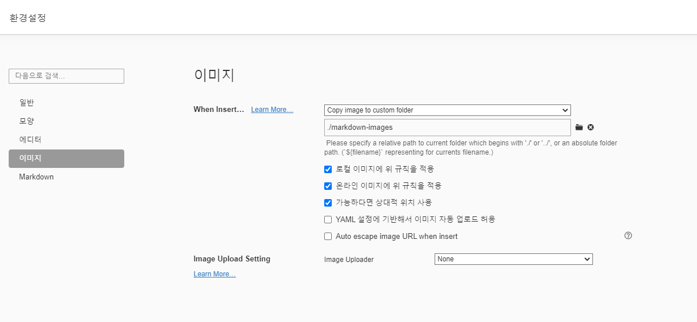

# 마크다운 문법

## 제목(heading)

제목은 `#`로 표현가능하다. `H1`~`H6`까지 표현가능하다.

### 제목3

#### 제목4

##### 제목5

###### 제목6

* 목록은

* 순서가 없는 목록이

* 있다.

  * 탭을 통해 목록 수준을 표현할 수 있다.

    * 우와
    * 엔터/탭으로 왔다갔다 할 수 있다.

    1. 순서가 있는 목록도

    2. 있다.

       1. 엔터를 누르고 *하면

       * 섞어서 쓸 수도 있다.
       
       

## 코드 블록

```Python
print('Hello!')
# 이것은 주석입니다.
```

```html
<!-- 주석 -->
#주석 아님
<body>
    <h1>
        Hello!
    </h1>
</body>
```


## 링크

외부 URL: [google](http://google.com)

특정 파일의 상대 경로: [README](./README.md)


## 이미지 파일


* 위와 같이 절대경로로 표현하면, Github 등에서 파일이 존재하지 않아 이미지가 제대로 출력되지 않는다.
* 따라서,  typora에 다음과 같은 설정을 해보자.



## 표

본문 - 표 - 표삽입

| 이름   | 나이 | 비고 |
| ------ | ---- | ---- |
| 홍길동 | 25   |      |
|        |      |      |
|        |      |      |


## 기타 문법

*기울임 이탤릭체*

**굵게 볼드체**

~~취소선~~

`인라인코드블록`

수직선

---


